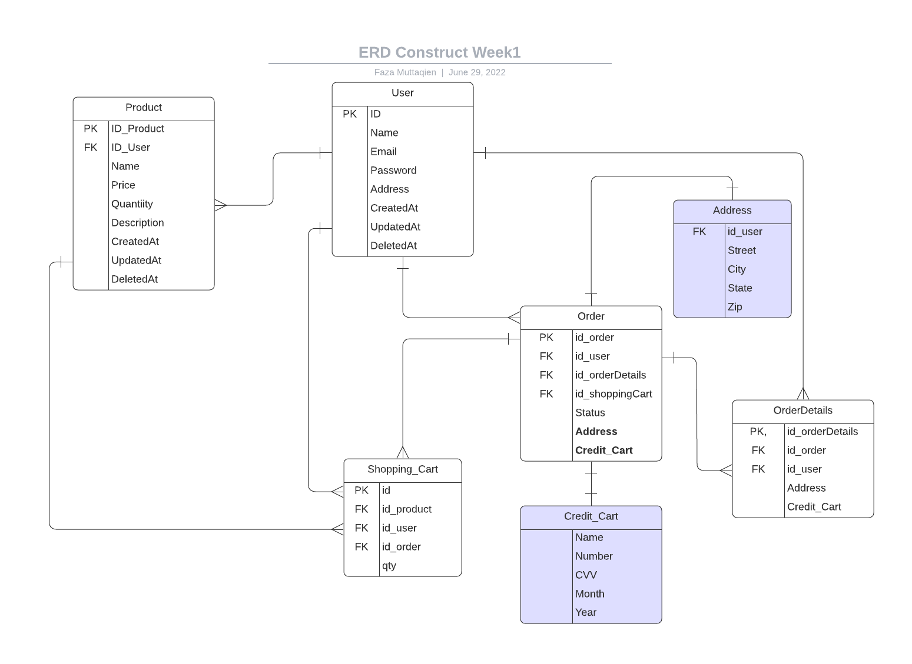

# Group Project 6 E-Commerce
<div id="top"></div>

<!-- PROJECT LOGO -->
<br/>
<div align="center">
<!--  mengarah ke repo  -->
  <a href="https://github.com/project-capstone">
    
  </a>

  <h3 align="center">Alta Notebook</h3>

  <p align="center">
    Group Project 6 Program Immersive Alterra Academy
    <br />
    <a href="https://app.swaggerhub.com/apis-docs/Rafkimaisya/group-6_project_e_commerce/1.0.0#/"><strong>» Open API »</strong></a>
    <br />
  </p>
</div>

# About
Repositori ini berisi proyek Construct Week-1 dengan tema E-Commerce yaitu sebuah aplikasi yang berfungsi untuk penjualan produk secara online dan fokus penjualan pada aplikasi ini yaitu aksesoris alat komputer.  

**Proses:**
- User melakukan registrasi untuk dapat melakukan transaksi jual-beli pada aplikasi.
- Setelah itu, user dapat login pada aplikasi dan bisa memulai transaksi jual-beli.


# Cara Menjalankan
## Pada Lokal Mesin

- clone repositori [ini](https://github.com/GROUP-6-E-COMMERCE/GROUP-6-BE-E-COMMERCE.git) pada lokal mesin dengan menjalankan perintah berikut:
```
git clone https://github.com/GROUP-6-E-COMMERCE/GROUP-6-BE-E-COMMERCE.git
```
- buat file `.env`:
```
export DB_USERNAME=<username-db>
export DB_PASSWORD=<password-db>
export DB_PORT=<port-db>
export DB_HOST=172.18.0.3
export DB_NAME=<nama-db>
```

- masuk pada direktori dan jalankan aplikasi dengan perintah berikut:
```
go run main.go
```
## Pada Server
> pastikan pada server anda sudah terinstall **docker** dan **mysql**
- clone repositori [ini](https://github.com/GROUP-6-E-COMMERCE/GROUP-6-BE-E-COMMERCE.git) pada lokal mesin dengan menjalankan perintah berikut:
```
git clone https://github.com/GROUP-6-E-COMMERCE/GROUP-6-BE-E-COMMERCE.git
```

# ERD
Berikut desain ERD dari sistem E-Commerce  

<!--  -->


<!-- CONTRIBUTOR -->
Contributor :
<br>
`Faza`  [](https://github.com/faza-muttaqien)

`Rafki` [](https://github.com/Rafkimaisya)

`David` [](https://github.com/davidwah)  

<br>
Mentor :
<br>
<!-- https://www.linkedin.com/in/iffakhry/ -->

[](https://www.linkedin.com/in/iffakhry/)
[](https://github.com/iffakhry)


<!-- end -->